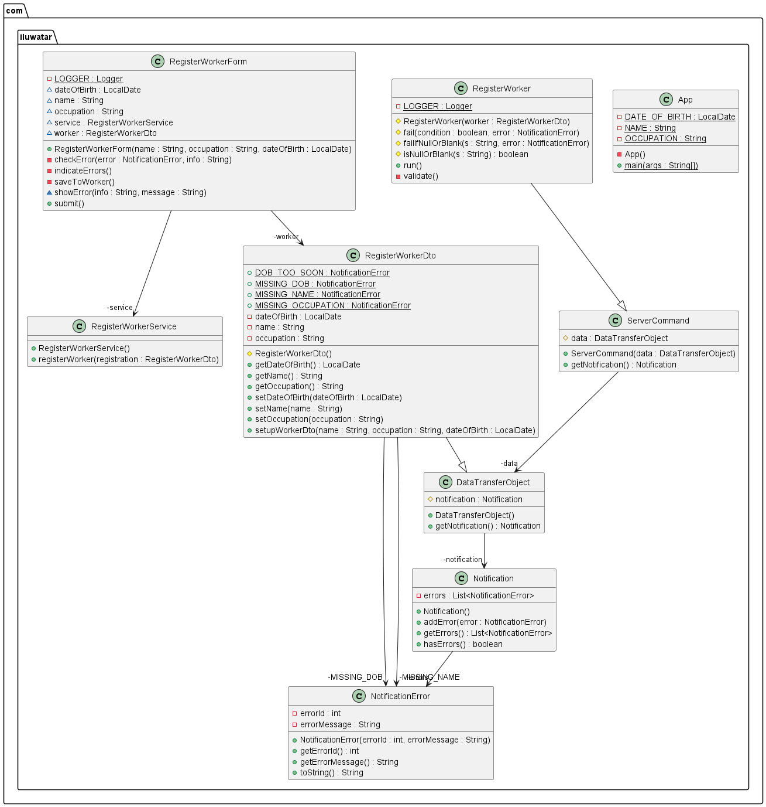

title: Notification
category: Behavioral
language: en 
tags:
    - Asynchronous
    - Decoupling
    - Event-driven
    - Messaging
    - Publish/subscribe
---

## Also known as

* Event Listener

## Intent

The Notification design pattern aims to facilitate communication between different parts of a system by allowing objects to subscribe to specific events and receive updates asynchronously when those events occur.

## Explanation

Real world example

> Consider a weather alert system as a real-world analogous example of the Notification design pattern. In this system, a weather station collects data on weather conditions like temperature, humidity, and storm alerts. Multiple subscribers, such as news agencies, smartphone weather apps, and emergency services, are interested in receiving updates about specific weather events, like severe storms or extreme temperatures.
>
> When the weather station detects a significant event, it publishes this information. All subscribed entities receive these updates automatically without the weather station needing to know the details of these subscribers. For instance, a news agency might use this information to update its weather report, while emergency services might use it to prepare for potential disasters. This system exemplifies the Notification pattern's ability to decouple the publisher (the weather station) from its subscribers and deliver timely updates efficiently.

In plain words

> The Notification design pattern enables an object to automatically notify a list of interested observers about changes or events without knowing the specifics of the subscribers.

**Programatic example**

The Notification pattern is used to capture information passed between layers, validate the information, and return any errors to the presentation layer if needed. It reduces coupling between the producer and consumer of events, enhances flexibility and reusability of components, and allows for dynamic subscription and unsubscription to events.

In this example, we'll use a form submission scenario to demonstrate the Notification pattern. The form is used to register a worker with their name, occupation, and date of birth. The form data is passed to the domain layer for validation, and any errors are returned to the presentation layer.

Here's the `RegisterWorkerForm` class, which acts as our presentation layer. It takes the worker's details as input and submits the form.

```java
class RegisterWorkerForm {

    private RegisterWorkerForm registerWorkerForm;

    RegisterWorkerForm(String name, String occupation, LocalDate dateOfBirth) {
        // Initialize the form with the worker's details
    }

    void submit() {
        // Submit the form
        // If there are any errors, they will be captured in the worker's notification
    }
}
```

The `RegisterWorker` class acts as our domain layer. It validates the worker's details and returns any errors through the `RegisterWorkerDto`.

```java
class RegisterWorker {

    RegisterWorker(String name, String occupation, LocalDate dateOfBirth) {
        // Validate the worker's details
        // If there are any errors, add them to the notification
    }
}
```

Finally, the `App` class is where the form is created and submitted.

```java
public class App {

  public static void main(String[] args) {
    var form = new RegisterWorkerForm("John Doe", "Engineer", LocalDate.of(1990, 1, 1));
    form.submit();
  }
}
```

In this example, if the worker's details are invalid (e.g. the name is empty), the `RegisterWorker` class will add an error to the notification. The `RegisterWorkerForm` class can then check the notification for any errors after submission. This demonstrates the Notification pattern, where information is passed between layers and any errors are returned to the presentation layer.

The form then processes the submission and returns these error messages to the user, showing our notification worked.

Example output:

```java
18:10:00.075 [main] INFO com.iluwatar.RegisterWorkerForm - Error 1: Name is missing: ""
18:10:00.079 [main] INFO com.iluwatar.RegisterWorkerForm - Error 2: Occupation is missing: ""
18:10:00.079 [main] INFO com.iluwatar.RegisterWorkerForm - Error 4: Worker registered must be over 18: "2016-07-13"
18:10:00.080 [main] INFO com.iluwatar.RegisterWorkerForm - Not registered, see errors
```

## Class diagram



## Applicability

* When a change to one object requires changing others, and you don’t know how many objects need to be changed.
* When an abstraction has two aspects, one dependent on the other. Encapsulating these aspects in separate objects lets you vary and reuse them independently.
* When a system component must be notified of events without making assumptions about the system’s other components.

## Known uses

* GUI frameworks where user actions trigger responses in the application.
* Notification systems in large-scale distributed systems.
* Event management in microservices architecture.

## Consequences

Benefits:

* Reduces coupling between the producer and consumer of events.
* Enhances flexibility and reusability of components.
* Allows for dynamic subscription and unsubscription to events.

Trade-offs:

* Can lead to a complex system if not managed well, due to the dynamic nature of subscriptions.
* Debugging can be challenging due to the asynchronous and decoupled nature of events.

## Related patterns

* [Command](https://java-design-patterns.com/patterns/command/): Can be used to encapsulate a request as an object, often used in conjunction with notifications to decouple the sender and receiver.
* [Mediator](https://java-design-patterns.com/patterns/mediator/): Facilitates centralized communication between objects, whereas the Notification pattern is more decentralized.
* [Observer](https://java-design-patterns.com/patterns/observer/): A foundational pattern for the Notification pattern, focusing on one-to-many dependency relationships.

## Credits

* [Martin Fowler - Notification Pattern](https://martinfowler.com/eaaDev/Notification.html)
* [Design Patterns: Elements of Reusable Object-Oriented Software](https://amzn.to/3w0pvKI)
* [Enterprise Integration Patterns: Designing, Building, and Deploying Messaging Solutions](https://amzn.to/3WcFVui)
