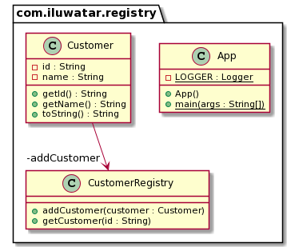

## Intent

To centralize the creation and management of a global set of objects, providing a single point of access and ensuring controlled instantiation.

## Explanation

Real-world example

> In a large corporation, managing IT assets such as laptops, desktops, servers, and software licenses can be challenging. To streamline this process, the company uses a centralized IT Asset Management System, which functions as a Registry.
>
> * The system provides a single point of access for registering, tracking, and retrieving information about all IT assets.
> * When a new device or software is procured, it is registered in the system with details such as serial number, purchase date, warranty period, and assigned user.
> * IT staff can query the system to get details about any asset, check its current status, and update information as needed.
> * This centralized management promotes efficient utilization and maintenance of assets, ensures compliance with software licenses, and helps in planning for upgrades or replacements.
>
> In this analogy, the IT Asset Management System acts as a Registry, managing the lifecycle and providing global access to information about IT assets within the organization.

In Plain Words

> Registry is a well-known object that other objects can use to find common objects and services.

wiki.c2.com says

> A registry is a global association from keys to objects, allowing the objects to be reached from anywhere. It involves two methods: one that takes a key and an object and add objects to the registry and one that takes a key and returns the object for the key. It's similar to the MultitonPattern, but doesn't restrict instances to only those in the registry.

**Programmatic Example**

The Registry design pattern is a well-known pattern used in software design where objects are stored and provide a global point of access to them. This pattern is particularly useful when you need to manage a global collection of objects, decouple the creation of objects from their usage, ensure a controlled lifecycle for objects, and avoid redundant creation of objects.

First, we have the `Customer` class. This class represents the objects that will be stored in the registry. Each `Customer` has an `id` and a `name`.

```java
public class Customer {
  private final String id;
  private final String name;

  public Customer(String id, String name) {
    this.id = id;
    this.name = name;
  }

  public String id() {
    return id;
  }

  public String name() {
    return name;
  }

  @Override
  public String toString() {
    return "Customer{" +
        "id='" + id + '\'' +
        ", name='" + name + '\'' +
        '}';
  }
}
```

Next, we have the `CustomerRegistry` class. This class is the actual registry where `Customer` objects are stored. It provides methods to add and retrieve customers. The `CustomerRegistry` is a singleton, meaning there is only one instance of it in the application.

```java
public final class CustomerRegistry {

  private static final CustomerRegistry instance = new CustomerRegistry();

  private final Map<String, Customer> customerMap;

  private CustomerRegistry() {
    customerMap = new ConcurrentHashMap<>();
  }

  public static CustomerRegistry getInstance() {
    return instance;
  }

  public Customer addCustomer(Customer customer) {
    return customerMap.put(customer.id(), customer);
  }

  public Customer getCustomer(String id) {
    return customerMap.get(id);
  }

}
```

Finally, we have the `App` class. This class demonstrates how to use the `CustomerRegistry`. It creates two `Customer` objects, adds them to the `CustomerRegistry`, and then retrieves them.

```java
public class App {

  private static final Logger LOGGER = LoggerFactory.getLogger(App.class);

  public static void main(String[] args) {
    CustomerRegistry customerRegistry = CustomerRegistry.getInstance();
    var john = new Customer("1", "John");
    customerRegistry.addCustomer(john);
    var julia = new Customer("2", "Julia");
    customerRegistry.addCustomer(julia);

    LOGGER.info("John {}", customerRegistry.getCustomer("1"));
    LOGGER.info("Julia {}", customerRegistry.getCustomer("2"));
  }

}
```

In this example, the `CustomerRegistry` provides a global point of access to `Customer` objects. This allows us to manage these objects in a centralized way, promoting reuse and sharing, and facilitating decoupling between components.

## Class diagram



## Applicability

* When you need to manage a global collection of objects.
* When you need to decouple the creation of objects from their usage.
* When you need to ensure a controlled lifecycle for objects, such as services or resources.
* When you want to avoid redundant creation of objects.

## Known Uses

* Managing database connections in an enterprise application.
* Providing a central place to register and retrieve services or components in a modular application.
* Creating a central configuration registry that various parts of an application can access.

## Consequences

Benefits:

* Centralizes object management, making the application easier to maintain.
* Promotes reuse and sharing of objects, which can reduce memory footprint and initialization time.
* Facilitates decoupling between components.

Trade-offs:

* Can become a bottleneck if not implemented efficiently.
* May introduce a single point of failure if the registry is not designed to be fault-tolerant.
* Increases complexity in managing the lifecycle of objects.

## Related Patterns

* [Singleton](https://java-design-patterns.com/patterns/singleton/): Often used in conjunction with the Registry to ensure there is a single instance of the Registry.
* [Factory](https://java-design-patterns.com/patterns/factory/): Used to encapsulate the instantiation logic that might be needed when objects are retrieved from the Registry.
* [Service Locator](https://java-design-patterns.com/patterns/service-locator/): A pattern that is similar in intent and structure, often used interchangeably with the Registry.
* [Dependency Injection](https://java-design-patterns.com/patterns/dependency-injection/): Provides an alternative method for managing dependencies, which can sometimes replace the need for a Registry.
* [Multiton](https://java-design-patterns.com/patterns/multiton/): Similar to the Registry in that it manages multiple instances, but does so based on keys, ensuring only one instance per key.

## Credits

* [Design Patterns: Elements of Reusable Object-Oriented Software](https://amzn.to/3w0pvKI)
* [Patterns of Enterprise Application Architecture](https://amzn.to/3WfKBPR)
* [Java Design Patterns: A Hands-On Experience with Real-World Examples](https://amzn.to/3yhh525)
* [Registry - Martin Fowler](https://www.martinfowler.com/eaaCatalog/registry.html)
* [Registry pattern - wiki.c2.com](https://wiki.c2.com/?RegistryPattern)
