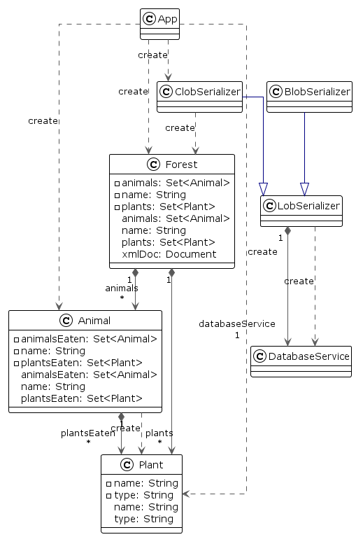

## Also known as

* Serialized Large Object
* Serialized BLOB
* Serialized CLOB

## Intent

To manage and store large objects (LOBs) like files, images, or large strings in a database efficiently using serialization.

## Explanation

Real-world example

> Consider a social media platform where users can upload and share images and videos. Instead of storing these large multimedia files on a separate file server, the platform uses the Serialized LOB design pattern to store the files directly in the database. Each uploaded image or video is serialized into a binary large object (BLOB) and stored within the user's record. This approach ensures that the multimedia files are managed within the same transactional context as other user data, providing consistency and simplifying data access and retrieval.

In plain words

> The Serialized LOB design pattern manages the storage of large objects, such as files or multimedia, by serializing and storing them directly within a database.

**Programmatic Example**

The Serialized Large Object (LOB) design pattern is a way to handle large objects in a database. It involves serializing an object graph into a single large object (a BLOB or CLOB, for Binary Large Object or Character Large Object, respectively) and storing it in the database. When the object graph needs to be retrieved, it is read from the database and deserialized back into the original object graph.

Here's a programmatic example of the Serialized LOB design pattern:

```java
public abstract class LobSerializer implements AutoCloseable {
  // ... omitted for brevity
  public abstract Object serialize(Forest toSerialize) throws Exception;
  public abstract Forest deSerialize(Object toDeserialize) throws Exception;
  // ... omitted for brevity
}
```

The `LobSerializer` class is an abstract class that provides the structure for serializing and deserializing objects. It has two abstract methods: `serialize` and `deSerialize`. These methods are implemented by the subclasses `ClobSerializer` and `BlobSerializer`.

```java
public class ClobSerializer extends LobSerializer {
  // ... omitted for brevity
  @Override
  public Object serialize(Forest forest) throws ParserConfigurationException, TransformerException {
    // ... omitted for brevity
  }

  @Override
  public Forest deSerialize(Object toDeserialize)
      throws ParserConfigurationException, IOException, SAXException {
    // ... omitted for brevity
  }
}
```

The `ClobSerializer` class provides an implementation for serializing and deserializing objects into XML strings. The `serialize` method converts a `Forest` object into an XML string, and the `deSerialize` method converts an XML string back into a `Forest` object.

```java
public class BlobSerializer extends LobSerializer {
  // ... omitted for brevity
  @Override
  public Object serialize(Forest toSerialize) throws IOException {
    // ... omitted for brevity
  }

  @Override
  public Forest deSerialize(Object toDeserialize) throws IOException, ClassNotFoundException {
    // ... omitted for brevity
  }
}
```

The `BlobSerializer` class provides an implementation for serializing and deserializing objects into binary data. The `serialize` method converts a `Forest` object into binary data, and the `deSerialize` method converts binary data back into a `Forest` object.

```java
// The App class uses the LobSerializer to serialize and deserialize a Forest object.
public class App {
  // ... omitted for brevity
  public static void main(String[] args) throws SQLException {
    Forest forest = createForest();
    LobSerializer serializer = createLobSerializer(args);
    executeSerializer(forest, serializer);
  }
  // ... omitted for brevity
}
```

The `App` class uses the `LobSerializer` to serialize and deserialize a `Forest` object. The `main` method creates a `Forest` object, creates a `LobSerializer` (either a `ClobSerializer` or a `BlobSerializer`), and then uses the `LobSerializer` to serialize and deserialize the `Forest` object.

## Class diagram



## Applicability

* Use when you need to store large objects in a database and want to optimize data access and storage.
* Ideal for applications that deal with large binary or character data such as multimedia files, logs, or documents.

## Known Uses

* Storing and retrieving images or multimedia files in a database.
* Managing large text documents or logs in enterprise applications.
* Handling binary data in applications that require efficient data retrieval and storage.

## Consequences

Benefits:

* Simplifies the handling of large objects by leveraging Java serialization.
* Reduces the need for external file storage systems.
* Ensures consistency by storing LOBs within the same transactional context as other data.

Trade-offs:

* Increases database size due to the storage of serialized data.
* Potential performance overhead during serialization and deserialization.
* Requires careful management of serialization format to maintain backward compatibility.

## Related Patterns

* [DAO (Data Access Object)](https://java-design-patterns.com/patterns/dao/): Often used in conjunction with Serialized LOB to encapsulate data access logic.
* Active Record: Can use Serialized LOB for managing large data within the same record.
* [Repository](https://java-design-patterns.com/patterns/repository/): Uses Serialized LOB to handle complex queries and data manipulation involving large objects.

## Credits

* [Effective Java](https://amzn.to/4cGk2Jz)
* [Java Persistence with Hibernate](https://amzn.to/44tP1ox)
* [Patterns of Enterprise Application Architecture](https://amzn.to/3WfKBPR)
* [Serialized LOB - Martin Fowler](https://martinfowler.com/eaaCatalog/serializedLOB.html) by Martin Fowler
